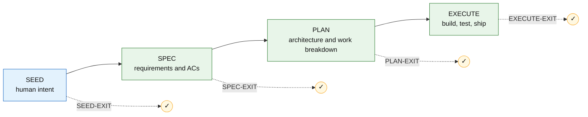
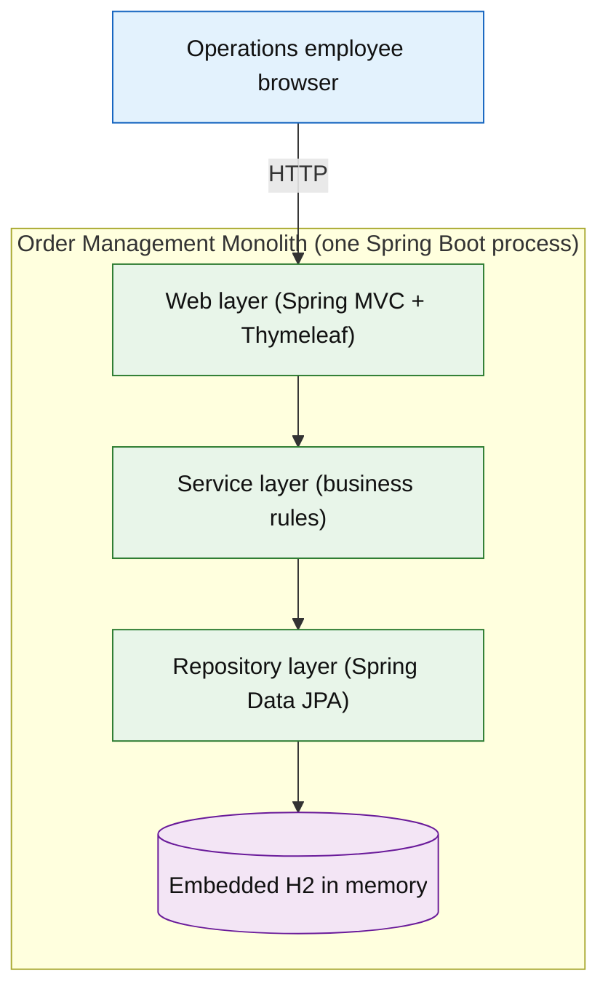

<div align="center">

# Fake Legacy Monolith — Order Management

### A deliberately legacy Java 8 / Spring Boot 2.7 three-tier order-management monolith — built end-to-end by an AI, and it runs anywhere Docker runs.

[](https://github.com/ajai-d/promptless-agentic-sdlc)
[](replay-execution/)
[](src/test/)
[](pom.xml)
[](LICENSE)

**[📖 The receipts](replay-execution/R-Z7UL7V-execution-log.md)** &nbsp;·&nbsp; **[🗺️ Stage diagram](replay-execution/R-Z7UL7V-execution-diagram.md)** &nbsp;·&nbsp; ⭐ Star it if the idea lands

</div>

---

## ✨ An AI built this end to end — and logged every decision

No human wrote the code. A developer described the intent in plain English in [`seed/seed.md`](seed/seed.md); an AI agent following the **Promptless Agentic SDLC (TWTTY)** then drove **specification → planning → implementation → testing → containerization**, pausing for human approval at every stage-exit gate. No per-task prompts were hand-authored — the whole build is one bootstrap prompt.

The difference from "AI slop": **every decision is recorded and replayable.**

`🤖 100% AI-authored` &nbsp;·&nbsp; `🚦 4/4 gates cleared` &nbsp;·&nbsp; `📦 8 work items` &nbsp;·&nbsp; `🧾 26 replay entries` &nbsp;·&nbsp; `✅ 4 tests passing`

> Skeptical? Read the append-only [`replay-execution/R-Z7UL7V-execution-log.md`](replay-execution/R-Z7UL7V-execution-log.md) — the approved prompt and outcome for every single step — or the visual [stage/gate diagram](replay-execution/R-Z7UL7V-execution-diagram.md).

## 🎯 What it does

A single Spring Boot process lets an internal operations employee manage **customers, products, inventory, and orders** through server-rendered browser pages. The business rules live in a service layer: stock validation on order placement, order-total calculation, order-status transitions (`NEW → CONFIRMED → SHIPPED`, or cancel), and cancel-restock. All three tiers — Spring MVC presentation, service-layer logic, and Spring Data JPA persistence — live in one codebase and ship as one deployable, backed by an embedded in-memory H2 database that re-seeds fictional data on every start.

> **It's a throwaway fixture, on purpose.** Fictional data only; not intended for real users, real data, or production. Its "legacy" character comes from the intentionally end-of-life framework generation and tight, package-by-layer coupling — a realistic target for **modernization exercises**, not a pile of planted vulnerabilities.

**Try, for example:**

> Add a product, set its stock, then place an order for it — watch the stock validate and the totals compute.
>
> Cancel an order and watch its items return to stock.
>
> Browse the ~50 seeded orders and step one through its status transitions.

## 🚀 Try it in 2 minutes

**Docker is the only thing you need installed.** Java 8 and Maven run *inside* the container build.

```powershell
git clone https://github.com/ajai-d/fake-monolith.git
cd fake-monolith
docker compose up --build    # first run pulls images + deps (a few minutes); open http://localhost:8080
docker compose down          # stop and remove the container
```

The home page shows the seeded counts (20 customers, 30 products, 50 orders). Data is in-memory, so it resets on every restart.

## 🤖 How an AI built this — the receipts

The build ran as four human-gated stages. Each gate was explicitly approved; each artifact is in the repo.



**The canonical artifacts — read these to understand (or reproduce) the project:**

| Stage | Artifact | What's in it |
| --- | --- | --- |
| SEED | [`seed/seed.md`](seed/seed.md) | The human's plain-English intent |
| SPEC | [`spec/spec-R-Z7UL7V.md`](spec/spec-R-Z7UL7V.md) | Goals, use cases, FR / NFR / acceptance criteria, data classification |
| PLAN | [`plan/plan-R-Z7UL7V.md`](plan/plan-R-Z7UL7V.md) | Architecture, design, `W-1..W-8` work breakdown |
| EXECUTE | [`replay-execution/R-Z7UL7V-execution-log.md`](replay-execution/R-Z7UL7V-execution-log.md) | Append-only log of every approved prompt + outcome |
| — | [`replay-execution/R-Z7UL7V-execution-diagram.md`](replay-execution/R-Z7UL7V-execution-diagram.md) | The stages and gates, visualized |

**Want to build your own this way?** The whole agentic implementation is a single bootstrap prompt — see the [Promptless Agentic SDLC methodology](https://github.com/ajai-d/promptless-agentic-sdlc).

---

# 🔬 Deep dive <sub>(for reviewers and contributors)</sub>

> Everything below is the engineering detail — architecture, every subsystem, every control, and how to run and test it yourself. Skip it unless you're evaluating the implementation.

## Architecture



Three tiers, one deployable, shared JPA entities across all layers — intentional legacy coupling, and a realistic modernization-exercise target.

## What was actually implemented

### 1. Web layer

Server-rendered Spring MVC controllers and Thymeleaf views for every workflow. Source: [`web/`](src/main/java/com/example/monolith/web).

- Controllers for customers, products, inventory, and orders; a `HomeController` dashboard.
- `GlobalExceptionHandler` renders a friendly 404 and never leaks stack traces.
- Inline form validation (re-render with field messages), plain CSS, no JS framework.

### 2. Service layer

The business rules, transactional. Source: [`service/`](src/main/java/com/example/monolith/service).

- `OrderService.placeOrder` — all-or-nothing: combines duplicate lines, validates stock, computes line + order totals, decrements stock.
- Order status machine with cancel-restock; `ProductService` enforces unique SKU and non-negative price/stock.

### 3. Domain + persistence

Shared entities and JPA repositories. Source: [`domain/`](src/main/java/com/example/monolith/domain) · [`repository/`](src/main/java/com/example/monolith/repository).

- `Customer`, `Product` (with `quantityOnHand`), `Order` (table `orders`), `OrderItem` (frozen `unitPriceAtOrder`), `OrderStatus` enum.
- Spring Data JPA repositories; `findBySku` for uniqueness checks.

### 4. Data initializer

Seeds fictional data at startup. Source: [`DataInitializer.java`](src/main/java/com/example/monolith/init/DataInitializer.java).

- ~20 customers, 30 products, 50 orders; deterministic (seeded RNG); idempotent.

### 5. Containerization

Local-first, nothing on the host. Source: [`Dockerfile`](Dockerfile) · [`docker-compose.yml`](docker-compose.yml).

- Multi-stage: Maven + JDK 8 build → JRE 8 runtime; non-root user; pinned base images; port 8080 only.

## Every control in one table

| Control | Where | Value |
| --- | --- | --- |
| Acceptance tests | [`src/test/`](src/test/java/com/example/monolith/OrderManagementAcceptanceTests.java) | 4 passing (AC-1…AC-4) |
| Secret scan | replay entry 021 | No findings (incl. `replay-execution/`) |
| Non-root container | `Dockerfile` | `appuser` uid 1001 |
| Pinned base images | `Dockerfile` | `maven:3.9-eclipse-temurin-8`, `eclipse-temurin:8-jre` |
| Single published port | `docker-compose.yml` | `8080:8080` |
| Branch-and-PR integration | git | Work on `W-1-app`, merged `--no-ff` to `main` |
| Append-only replay log | `replay-execution/` | 26 entries, every decision recorded |

> **Level 1 (prototype) reductions, by design:** no CI/CD, code review, SAST/dependency/license scanning, or threat modeling; accessibility is a non-tested design target. The acknowledgments are recorded in the [spec](spec/spec-R-Z7UL7V.md) and [replay log](replay-execution/R-Z7UL7V-execution-log.md).

## The R-Z7UL7V result <sub>(by the numbers)</sub>

- **8 work items** shipped across `SEED → SPEC → PLAN → EXECUTE`
- **26 replay-log entries** — every decision with its approved prompt and outcome
- **4 macro gates cleared** — SEED-EXIT · SPEC-EXIT · PLAN-EXIT · EXECUTE-EXIT
- **4 tests passing** (AC-1…AC-4); no coverage floor at Level 1
- **Seed data:** 20 customers / 30 products / 50 orders, verified live
- **Runs locally:** `docker compose up --build` → HTTP 200 at `http://localhost:8080`

## 🧭 Clone and run

### Prerequisites

**Docker** (Docker Desktop or a compatible engine). Nothing else — Java 8, Maven, and all dependencies run inside the container build.

### Run it

```powershell
git clone https://github.com/ajai-d/fake-monolith.git
cd fake-monolith
docker compose up --build    # open http://localhost:8080
docker compose down
```

### Verify

Open `http://localhost:8080` (home shows seeded counts), then walk a flow: create a customer → add a product → set stock → place an order → cancel it and confirm the stock returns.

### Run the tests

The suite runs inside the Maven container, so you still install nothing:

```powershell
docker run --rm -v ${PWD}:/app -w /app maven:3.9-eclipse-temurin-8 mvn test
```

Covers AC-1 (app serves), AC-2 (order totals + stock decrement), AC-3 (over-stock rejected transactionally), AC-4 (cancel restocks).

---

## 🔁 Continue with TWTTY

Pick up where the agent left off, ship a new release, or hand off to a colleague — all against the append-only replay log as ground truth.

**Resume the current release** (already at `EXECUTE-EXIT`, so this will report completion). Open a fresh GitHub Copilot Chat in **Agent mode** and paste:

```text
Read promptless-agentic-sdlc/twtty/methodology/core-twtty-methodology.md and act strictly as the AI Agent it defines.

Resume the project at fake-monolith.
```

**Start a new release** (e.g., add auth, a REST API, or persistence):

```text
Read promptless-agentic-sdlc/twtty/methodology/core-twtty-methodology.md and act strictly as the AI Agent it defines.

Start a new release on the project at fake-monolith.
```

The agent reads every `R*-execution-log*.md` in `replay-execution/`, finds the last approved entry, tells you exactly where things stand, and proposes the next step. A new release reuses the seed and produces a delta spec and plan.

## License

MIT — see [LICENSE](LICENSE).
