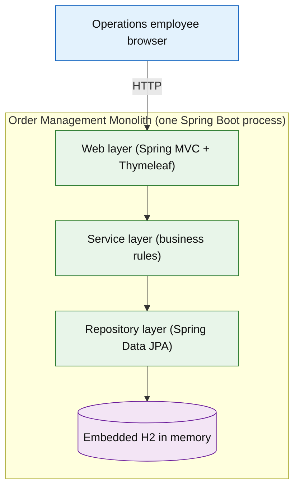

# Fake Legacy Monolith — Order Management

> A deliberately legacy-style, three-tier **Java 8 / Spring Boot 2.7** order-management monolith — server-rendered, one deployable, runs locally in Docker. Built as a fictional fixture for demos, training, and **modernization exercises**. Delivered end-to-end by an AI coding agent following the **Promptless Agentic SDLC (TWTTY)** methodology using the **baseline SDLC** specialized implementation.


-lightgrey)

> **This is a throwaway demo/training fixture.** It uses only fictional data and is **not** intended for real users, real or customer data, production traffic, or long-lived operation as a real system. Its "legacy" character comes from the intentionally end-of-life framework generation and tightly coupled, package-by-layer architecture — **not** from deliberately introduced vulnerabilities.

---

## What it does

A single Spring Boot process lets an internal **operations employee** manage **customers, products, inventory, and orders** through server-rendered browser pages. Core business rules are enforced in a service layer: stock validation on order placement, order-total calculation, order-status transitions, and cancel-restock.

All three tiers — Spring MVC presentation, service-layer business logic, and Spring Data JPA data access — live in **one codebase** and ship as **one deployable**, backed by an embedded in-memory H2 database that re-seeds fictional sample data on every startup.

## Try it locally (Docker only)

> **The only thing you need installed is Docker** (Docker Desktop or a compatible engine). Java 8, Maven, and every dependency are downloaded and run *inside* the container build — nothing is installed on your host.

From the project folder's root:

```powershell
docker compose up --build    # build the image and start the app
# first run pulls base images and downloads dependencies (a few minutes); later runs are fast
# then open http://localhost:8080
docker compose down          # stop and remove the container
```

The data is fictional and held in memory, so it resets every time the app restarts.

## How this was built

This fixture was delivered end-to-end by an AI coding agent following the **Promptless Agentic SDLC (TWTTY)** methodology, baseline **SDLC** implementation. The intent was captured in plain English in [`seed/seed.md`](seed/seed.md); the agent then drove specification, planning, and implementation, checking with the human at each stage-exit gate.

Every decision is recorded in an append-only replay-execution log that any future contributor (or AI agent) can read to understand or reproduce the release:

- [`seed/seed.md`](seed/seed.md) — human intent (SEED)
- [`spec/spec-R-Z7UL7V.md`](spec/spec-R-Z7UL7V.md) — requirements, use cases, acceptance criteria (SPEC)
- [`plan/plan-R-Z7UL7V.md`](plan/plan-R-Z7UL7V.md) — architecture, design, W-1…W-8 work breakdown (PLAN)
- [`replay-execution/R-Z7UL7V-execution-log.md`](replay-execution/R-Z7UL7V-execution-log.md) — append-only log of every approved step
- [`replay-execution/R-Z7UL7V-execution-diagram.md`](replay-execution/R-Z7UL7V-execution-diagram.md) — visual summary of the stages and gates

---

# Deep dive: what's inside

## Architecture



Three tiers, one deployable: a Spring MVC presentation tier renders Thymeleaf pages; a service tier holds the business rules; a Spring Data JPA tier persists to an embedded in-memory H2 database that re-seeds on every startup. All layers share the same JPA entities — intentional legacy coupling, and a realistic modernization-exercise target.

## What was implemented

| Area | Source | Highlights |
| --- | --- | --- |
| Domain model | [`domain/`](src/main/java/com/example/monolith/domain) | `Customer`, `Product` (with `quantityOnHand`), `Order` (table `orders`), `OrderItem` (frozen `unitPriceAtOrder`), `OrderStatus` enum |
| Repositories | [`repository/`](src/main/java/com/example/monolith/repository) | Spring Data JPA; `ProductRepository.findBySku` |
| Services | [`service/`](src/main/java/com/example/monolith/service) | Transactional order placement (combine duplicate lines, validate stock, compute totals, decrement), SKU uniqueness, non-negative price/stock, status transitions, cancel-restock |
| Web | [`web/`](src/main/java/com/example/monolith/web) | Controllers for customers, products, inventory, orders; `GlobalExceptionHandler` 404 page; inline validation |
| Views | [`templates/`](src/main/resources/templates) | Server-rendered Thymeleaf pages + plain CSS, no JS framework |
| Seed data | [`DataInitializer.java`](src/main/java/com/example/monolith/init/DataInitializer.java) | ~20 customers, 30 products, 50 orders of fictional data at startup |
| Tests | [`OrderManagementAcceptanceTests.java`](src/test/java/com/example/monolith/OrderManagementAcceptanceTests.java) | AC-1…AC-4 (home 200, order totals/stock, over-stock rollback, cancel-restock) |
| Container | [`Dockerfile`](Dockerfile), [`docker-compose.yml`](docker-compose.yml) | Multi-stage (Maven+JDK8 build → JRE8 runtime), non-root user, pinned images, port 8080 |

## Controls (what Level 1 applied)

| Control | Where | Value |
| --- | --- | --- |
| Acceptance tests | `src/test/...` | 4 tests, all passing (AC-1…AC-4) |
| Secret scan | 3d (replay log entry 021) | No findings (incl. `replay-execution/`) |
| Non-root container | `Dockerfile` | `appuser` uid 1001 |
| Pinned base images | `Dockerfile` | `maven:3.9-eclipse-temurin-8`, `eclipse-temurin:8-jre` |
| Single published port | `docker-compose.yml` | `8080:8080` |
| Branch-and-PR integration | git | Work on `W-1-app`, merged `--no-ff` to `main` |
| Append-only replay log | `replay-execution/` | Every approved step recorded |

Note (Level 1 reductions, by design): no CI/CD, no code review, no SAST/dependency/license scanning, no threat modeling, and accessibility is a non-tested design target. See the spec and replay log for the recorded acknowledgments.

## The R-Z7UL7V result

- **8 work items** shipped across `SEED → SPEC → PLAN → EXECUTE`
- **4 macro gates cleared** — SEED-EXIT, SPEC-EXIT, PLAN-EXIT, EXECUTE-EXIT
- **4 tests, 4 passing** (AC-1…AC-4)
- **Seed data**: 20 customers / 30 products / 50 orders, verified live
- **Runs locally**: `docker compose up --build` → HTTP 200 at `http://localhost:8080`

## Clone and run

Prerequisite: **Docker** (Docker Desktop or compatible). Nothing else — Java 8 and Maven run inside the build.

```powershell
docker compose up --build    # build + start; open http://localhost:8080
docker compose down          # stop + remove containers
```

Run the tests (in the Maven container, off your host):

```powershell
docker run --rm -v ${PWD}:/app -w /app maven:3.9-eclipse-temurin-8 mvn test
```

## Continue with TWTTY

This project was built with the **Promptless Agentic SDLC (TWTTY)**. To resume or extend it, open a fresh agent chat and point it at the methodology:

```text
Read promptless-agentic-sdlc/twtty/methodology/core-twtty-methodology.md and act strictly as the AI Agent it defines.

Resume the project at fake-monolith.
```

To start a new release once this one is complete, replace "Resume" with "Start a new release on". The agent reads [`replay-execution/R-Z7UL7V-execution-log.md`](replay-execution/R-Z7UL7V-execution-log.md) to recover exactly where things stand.

## License

MIT — see [LICENSE](LICENSE).

