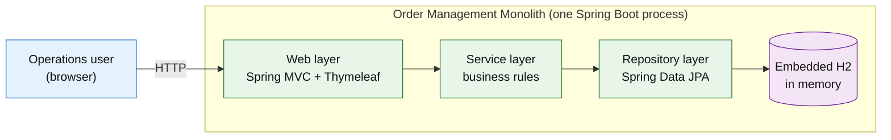
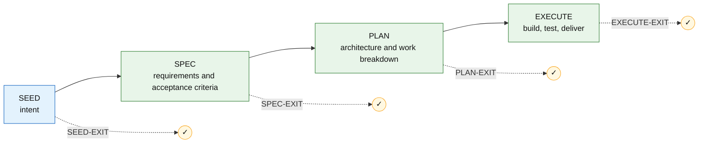

<div align="center">

# Order Management Monolith

#### A three-tier Java 8 / Spring Boot 2.7 order-management application — server-rendered, self-contained, and runnable with a single Docker command.

[](src/test/)
[](pom.xml)
[](LICENSE)
[](#how-this-project-was-built)

[Quickstart](#quickstart) &nbsp;·&nbsp; [Architecture](#architecture) &nbsp;·&nbsp; [Usage](#usage)

</div>

> Built with the **[Promptless Agentic SDLC (TWTTY)](#how-this-project-was-built)** — a spec-driven, human-governed engineering workflow. The full requirements, plan, and decision record live in-repo; see [How this project was built](#how-this-project-was-built).

---

## Overview

Order Management Monolith is a small, self-contained web application for running a simple order desk: an operations user manages customers, products, inventory, and orders from server-rendered pages in the browser. It models the core of an order-management system — placing orders against live stock, computing totals, and moving orders through their lifecycle — in a single deployable process.

It is deliberately built in a **legacy three-tier style** (Spring MVC + Thymeleaf over a Spring service layer over Spring Data JPA, with shared domain entities and package-by-layer organization) on an intentionally older framework generation. That makes it a realistic, understandable target for **demonstrations, teaching, and modernization exercises** — for example, splitting a monolith into services or migrating off an end-of-life framework.

**Scope and boundaries.** The application uses only fictional, in-memory data that resets on restart. It is a reference/fixture application, not a production system: there is no authentication, no external integrations, and no persistent datastore. Its "legacy" character comes from its architecture and framework age, not from intentionally insecure code.

## Features

- Manage **customers** — create and list customer records.
- Manage **products** — create and edit products with unique SKUs and prices.
- Manage **inventory** — adjust on-hand stock per product.
- Place **orders** — add line items, validate against available stock, and compute line and order totals in one transaction.
- Move orders through their **lifecycle** — `NEW → CONFIRMED → SHIPPED`, or cancel (which restocks the items).
- **Auto-seeded demo data** — ~20 customers, 30 products, and 50 orders are created on startup.
- **One-command local run** — starts in Docker with no host-side Java or Maven install.

## Quickstart

### Prerequisites

**Docker** (Docker Desktop or a compatible engine) is the only requirement. Java 8, Maven, and all dependencies run inside the container build — nothing is installed on your host.

```powershell
docker --version    # verify Docker is installed and running
```

### Run

```powershell
git clone https://github.com/ajai-d/fake-monolith.git
cd fake-monolith
docker compose up --build
```

The first build pulls base images and dependencies (a few minutes); later runs are fast. When it's up, open **http://localhost:8080**. Stop and remove the container with `docker compose down`.

### Verify

The home page shows the seeded counts (20 customers, 30 products, 50 orders). Navigate to **Orders** to see the seeded orders, or **Products** to see the catalog. Data is held in memory and resets on each restart.

## Architecture

The application is a single Spring Boot process with three clearly separated tiers, shown below. Its defining characteristic is deliberate, legacy-style coupling: all tiers share the same JPA domain entities and the code is organized package-by-layer. That is exactly what makes it a realistic target for modernization exercises rather than a model of clean architecture.



**Stack:** Java 8 · Spring Boot 2.7 · Spring MVC + Thymeleaf · Spring Data JPA · H2 (in-memory) · Maven · Docker.

The authoritative architecture — the full component breakdown, design decisions, and technology rationale — lives in the plan, [`plan/plan-R-Z7UL7V.md`](plan/plan-R-Z7UL7V.md), which is maintained as the single source of truth.

## Usage

The top navigation links the four areas — Customers, Products, Inventory, Orders — plus **New order**. A typical end-to-end flow:

1. **Add a customer** — *Customers → New customer*, enter a name (required) and optional contact details.
2. **Add a product** — *Products → New product*, enter a unique SKU, name, and unit price.
3. **Set stock** — *Inventory → Adjust stock* for the product, enter the quantity on hand.
4. **Place an order** — *New order*, pick the customer, add product lines with quantities, and submit. The order is accepted only if every line is within available stock; on success it decrements stock and records line totals and an order total. Over-stock orders are rejected as a whole, leaving stock unchanged.
5. **Progress the order** — open it from *Orders*, then **Confirm → Ship**, or **Cancel** (which returns the items to stock).

## Project structure

```text
fake-monolith/
├── src/main/java/com/example/monolith/
│   ├── web/            Controllers, exception handler
│   ├── service/        Business rules (orders, inventory, products, customers)
│   ├── repository/     Spring Data JPA repositories
│   ├── domain/         JPA entities + OrderStatus enum
│   ├── init/           Startup data seeding
│   └── Application.java
├── src/main/resources/
│   ├── templates/      Thymeleaf views
│   ├── static/css/     Stylesheet
│   └── application.properties
├── src/test/           Acceptance tests
├── Dockerfile          Multi-stage build (Maven+JDK8 → JRE8), non-root
├── docker-compose.yml  Single service, port 8080
├── seed/               Human intent (TWTTY SEED output)
├── spec/               Requirements and acceptance criteria (SPEC)
├── plan/               Architecture and work breakdown (PLAN)
└── replay-execution/   Append-only record of how it was built
```

## Configuration

Configuration lives in [`src/main/resources/application.properties`](src/main/resources/application.properties):

| Setting | Default | Purpose |
| --- | --- | --- |
| `server.port` | `8080` | HTTP port (also mapped in `docker-compose.yml`) |
| `spring.datasource.url` | `jdbc:h2:mem:ordersdb` | In-memory H2 database |
| `spring.jpa.hibernate.ddl-auto` | `create` | Recreate the schema on each start |

## Testing

The test suite runs inside the Maven container, so you still install nothing:

```powershell
docker run --rm -v ${PWD}:/app -w /app maven:3.9-eclipse-temurin-8 mvn test
```

Four acceptance tests cover the core behavior: the application serves its home page; placing a valid order decrements stock and computes totals; an over-stock order is rejected transactionally; and cancelling an order restocks its items.

---

## How this project was built

This project was built with the **[Promptless Agentic SDLC (TWTTY)](https://github.com/ajai-d/promptless-agentic-sdlc)**: a developer captured intent in plain English and an AI agent drove the work through four human-governed stages — each ending in an approval gate — recording every decision in an append-only log. Here, the developer approved `SEED` / `SPEC` / `PLAN` interactively, then authorized Autopilot for the build.



The full record is in the repo: [`seed/`](seed/seed.md) · [`spec/`](spec/spec-R-Z7UL7V.md) · [`plan/`](plan/plan-R-Z7UL7V.md) · [`replay-execution/`](replay-execution/R-Z7UL7V-execution-log.md). To continue or extend it, open GitHub Copilot Chat in Agent mode and resume the project with the [methodology](https://github.com/ajai-d/promptless-agentic-sdlc).

## License

MIT — see [LICENSE](LICENSE).
