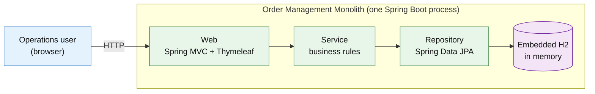
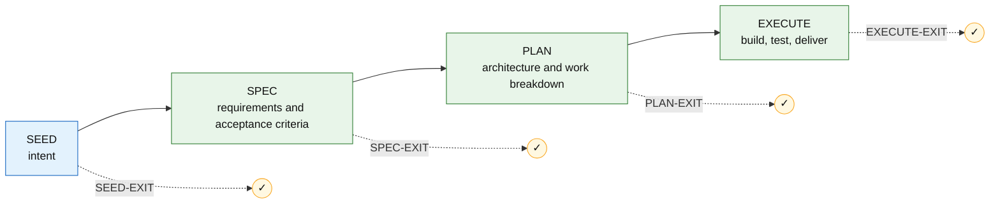

<div align="center">

# Order Management Monolith

#### A three-tier Java 8 / Spring Boot 2.7 order-management app — server-rendered, self-contained, and runnable with a single Docker command.

[](src/test/)
[](pom.xml)
[](LICENSE)
[](#how-this-project-was-built)

[Quickstart](#quickstart) &nbsp;·&nbsp; [Architecture](#architecture) &nbsp;·&nbsp; [How it was built](#how-this-project-was-built)

</div>

> Built with the **[Promptless Agentic SDLC (TWTTY)](#how-this-project-was-built)** — a spec-driven, human-governed engineering workflow.

---

## Overview

A self-contained web app for a simple order desk: an operations user manages customers, products, inventory, and orders from server-rendered pages — placing orders against live stock, computing totals, and moving them through their lifecycle (`NEW → CONFIRMED → SHIPPED`, or cancel-and-restock). It's a deliberately legacy three-tier Spring application on an end-of-life framework, which makes it a realistic target for demos and modernization exercises. Data is fictional and in-memory (it resets on restart); this is a reference fixture, not a production system.

## Quickstart

Docker is the only prerequisite — Java 8 and Maven run inside the build.

```powershell
git clone https://github.com/ajai-d/fake-monolith.git
cd fake-monolith
docker compose up --build    # open http://localhost:8080  (docker compose down to stop)
```

On startup it seeds ~20 customers, 30 products, and 50 orders.

## Architecture

Three layers in one Spring Boot process: a Spring MVC + Thymeleaf **web** layer delegates to a **service** layer (business rules), which uses a Spring Data JPA **repository** layer over an embedded in-memory **H2** database. All layers share the same JPA entities — intentional legacy coupling.



**Stack:** Java 8 · Spring Boot 2.7 · Spring MVC + Thymeleaf · Spring Data JPA · H2 · Maven · Docker.

## Usage

The top navigation links Customers, Products, Inventory, and Orders. A typical flow: add a product and set its stock → place an order (validated against stock, with line and order totals computed) → advance it (Confirm → Ship) or cancel it (which restocks the items).

## Testing

```powershell
docker run --rm -v ${PWD}:/app -w /app maven:3.9-eclipse-temurin-8 mvn test
```

Four acceptance tests cover: the app serves; valid orders decrement stock and compute totals; over-stock orders are rejected transactionally; and cancelling restocks.

---

## How this project was built

This project was built with the **[Promptless Agentic SDLC (TWTTY)](https://github.com/ajai-d/promptless-agentic-sdlc)**: a developer captured intent in plain English and an AI agent drove the work through four human-governed stages — each ending in an approval gate — recording every decision in an append-only log. Here, the developer approved `SEED` / `SPEC` / `PLAN` interactively, then authorized Autopilot for the build.



The full record is in the repo: [`seed/`](seed/seed.md) · [`spec/`](spec/spec-R-Z7UL7V.md) · [`plan/`](plan/plan-R-Z7UL7V.md) · [`replay-execution/`](replay-execution/R-Z7UL7V-execution-log.md). To continue or extend it, open GitHub Copilot Chat in Agent mode and resume the project with the [methodology](https://github.com/ajai-d/promptless-agentic-sdlc).

## License

MIT — see [LICENSE](LICENSE).
