# Plan — R-Z7UL7V

## Metadata

- **Release ID:** R-Z7UL7V
- **Plan confirmed date:** 2026-10-01

---

## 1. Architecture

### 1.1 Domains and application architecture

Single domain — the whole system.

**Components** (legacy package-by-layer; shared entities across layers):

- **C-1:** Web layer — Spring MVC controllers and Thymeleaf views; request handling, form binding, and validation.
- **C-2:** Service layer — business logic for order placement, inventory validation, order-total calculation, status transitions, and cancel-restock.
- **C-3:** Repository layer — Spring Data JPA repositories for Customer, Product, and Order.
- **C-4:** Domain model — shared JPA entities (Customer, Product, Order, OrderItem) used across all layers.
- **C-5:** Data initializer — seeds the schema and fictional sample data at startup.
- **C-6:** Application bootstrap and configuration — Spring Boot main class and configuration (H2, Thymeleaf, server port).

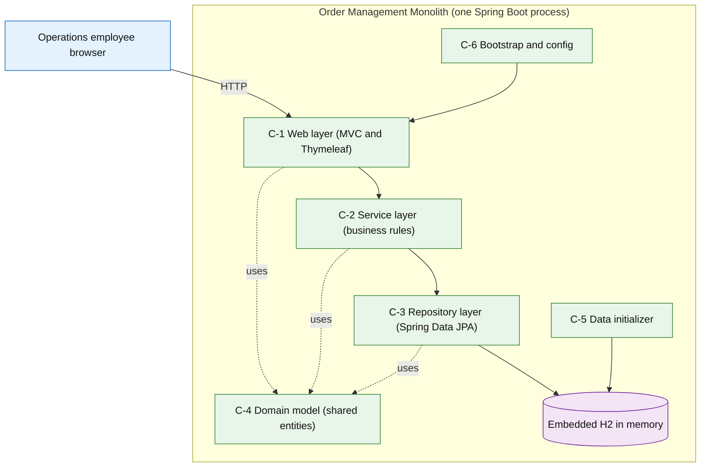

### 1.2 Data architecture

Single in-memory H2 database, created and seeded at startup, discarded on container stop (ephemeral, internal fictional data). Entities and relationships:

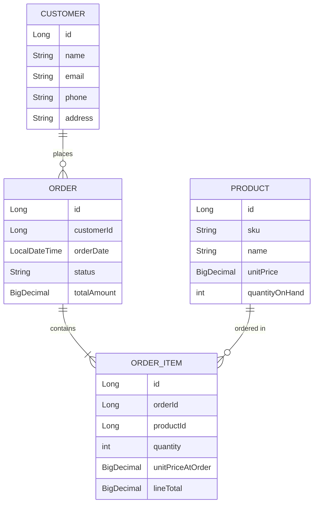

### 1.3 Infrastructure architecture

Local only. A single Docker Compose service runs the Spring Boot application in one container publishing port 8080 to the host; the H2 database is embedded in-process (no separate database container). No cloud, no external services. Deployment strategy and rollback are not declared (risk level below 3).

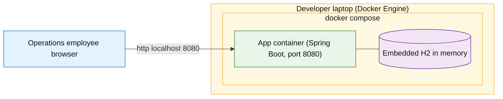

### 1.4 Security architecture

Required because spec §14.1 declares `internal` data. Controls:

- **Encryption in transit:** all traffic is loopback between the browser and the container on a single developer host; no data crosses a network boundary, so TLS is not applied. If the app were ever exposed beyond localhost, TLS would be required.
- **Encryption at rest:** not applicable — data is ephemeral in-memory only and no `confidential`/`restricted` class is present.
- **Authentication/authorization:** none, by spec decision (single implicit operator).
- **Secrets:** none stored; secret scanning applies at 3d.

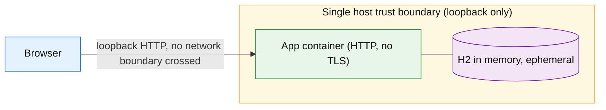

### 1.5 Technology choices

- **Currency:** Options were looked up at plan time (2026-10-01). Spring Boot 2.7.x reached end of OSS support in June 2023 and is the last line supporting Java 8; the current line is Spring Boot 4.1.x, which requires Java 17 or newer. Sources consulted: endoflife.date/spring-boot and versionlog.com/spring-boot (treated as untrusted data). The intentionally end-of-life stack is deliberate — it is what makes this a realistic legacy/modernization fixture.
- **Human User preferences:** Confirmed the intentionally-legacy Java 8 + Spring Boot 2.7.x stack; accepted the JUnit 5 and plain-CSS defaults; no other preferences stated.

- Java 8 — the legacy runtime the fixture targets.
- Spring Boot 2.7.x — last line supporting Java 8; the intentionally end-of-life framework generation.
- Maven — traditional enterprise build tool.
- Spring MVC with Thymeleaf — server-rendered HTML views.
- Spring Data JPA with Hibernate — ORM data-access layer.
- H2 (in-memory) — embedded, auto-seeded database requiring no external service.
- JUnit 5 with Spring Boot Test and MockMvc — Spring Boot 2.7 default test stack.
- Plain CSS (no build step) — minimal legacy-styled UI without a front-end toolchain.
- `maven:3.8-eclipse-temurin-8` (build stage) and `eclipse-temurin:8-jre` (runtime stage), version-pinned — multi-stage container keeps Java 8 and Maven off the host.

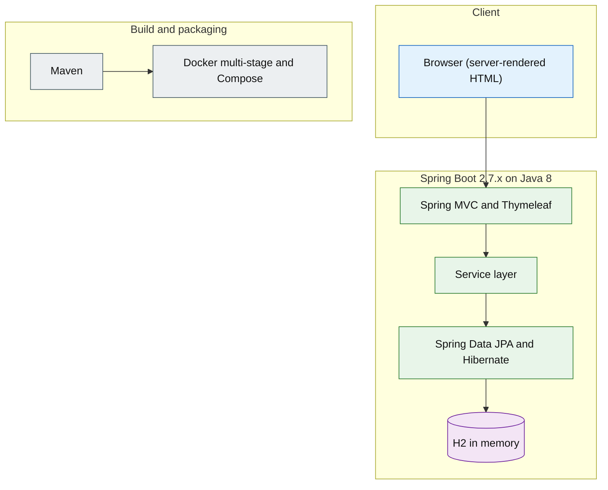

### 1.6 Test architecture

Minimal suite covering only the four tested acceptance criteria (AC-1 through AC-4). Integration tests use `@SpringBootTest` with MockMvc; unit tests cover the service-layer business rules. No end-to-end, performance, or accessibility tests. No numeric coverage floor applies (diff and cumulative floors begin at risk level 3). Tests live under `src/test/java`.

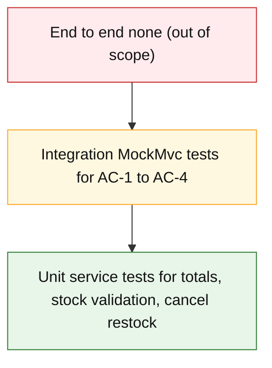

### 1.7 Operations architecture

None for this release.

## 2. Design

### 2.1 Application design

- **D-1:** Controllers — `CustomerController`, `ProductController`, `OrderController`. Thin controllers that bind form submissions, run `BindingResult` validation, call the service layer, and select Thymeleaf views.
  - **Refines:** C-1
- **D-2:** Service interfaces — `CustomerService`, `ProductService`, `OrderService` with `@Transactional` business methods (create/update entities, adjust stock, place order, change order status with restock on cancel).
  - **Refines:** C-2
- **D-3:** Repositories — interfaces extending `JpaRepository<Entity, Long>` for Customer, Product, and Order.
  - **Refines:** C-3
- **D-4:** Entities — `Customer`, `Product`, `Order`, `OrderItem` with JPA mappings and an `OrderStatus` enum (NEW, CONFIRMED, SHIPPED, CANCELLED). `OrderItem` captures `unitPriceAtOrder` and `lineTotal`.
  - **Refines:** C-4
- **D-5:** `DataInitializer` — an `ApplicationRunner` that seeds approximately 20 customers, 30 products, and 50 orders at startup.
  - **Refines:** C-5
- **D-6:** Configuration — `application.properties` configuring in-memory H2, `ddl-auto=create`, Thymeleaf, and server port 8080; Spring Boot main class.
  - **Refines:** C-6

**UC-1 Manage customers (create)**

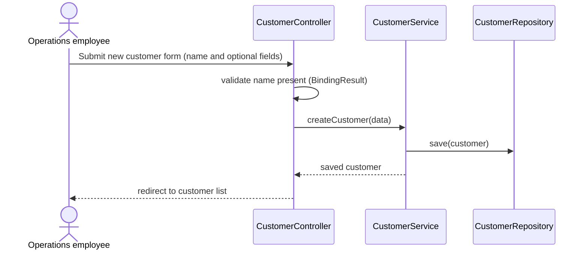

**UC-2 Manage products (create or edit)**

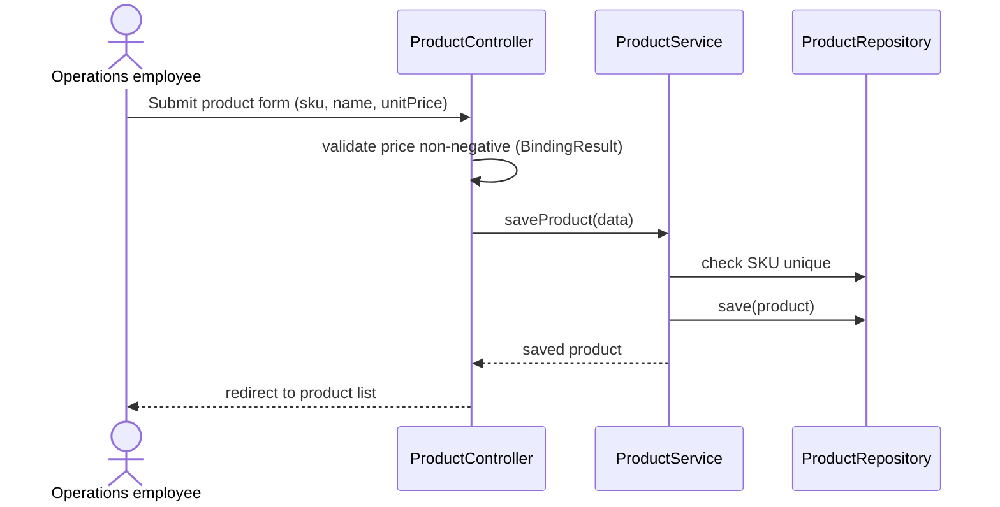

**UC-3 Manage inventory (adjust stock)**

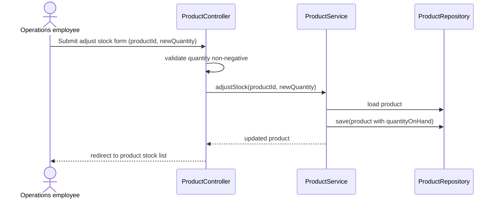

**UC-4 Place order**

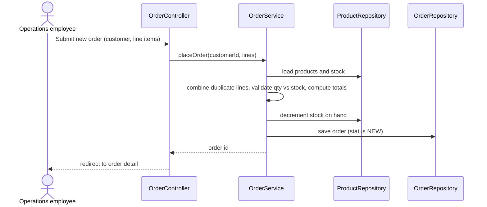

**UC-5 Review orders (advance or cancel)**

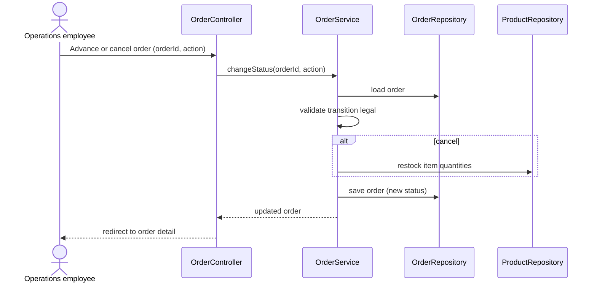

### 2.2 Data design

None for this release.

### 2.3 Infrastructure design

None for this release.

### 2.4 Security design

None for this release.

### 2.5 Test design

None for this release.

### 2.6 UX design

**Design foundations.** No heavy design system; a plain-CSS, utilitarian legacy layout built from tables and forms, a system font, a limited palette, and standard spacing. This keeps the look period-accurate for an old enterprise app and avoids a front-end toolchain.

**Information architecture.** A persistent top navigation with Customers, Products, Inventory, and Orders. Each section presents a list view (table) and a form view; every screen has one clear primary action (for example, New customer). Empty states render a short "No records" message; errors render a generic error page, and form errors render inline next to the fields.

**Content design.** Terse, plain labels; error messages state what went wrong and what to do next.

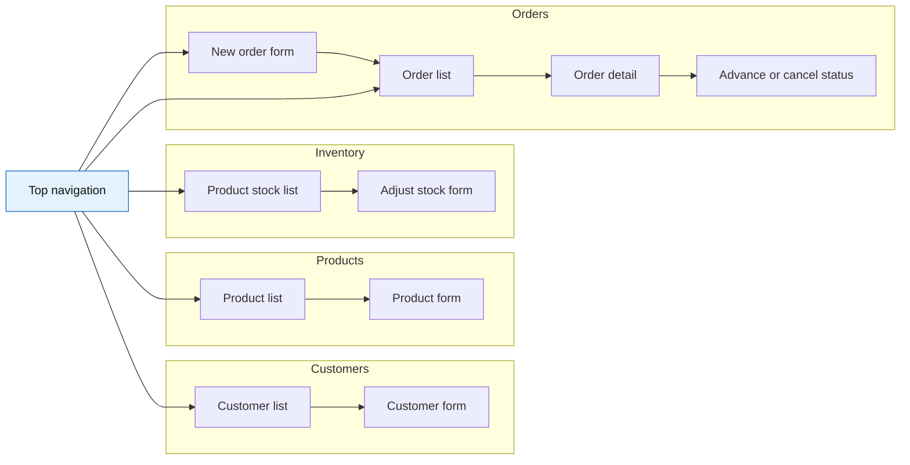

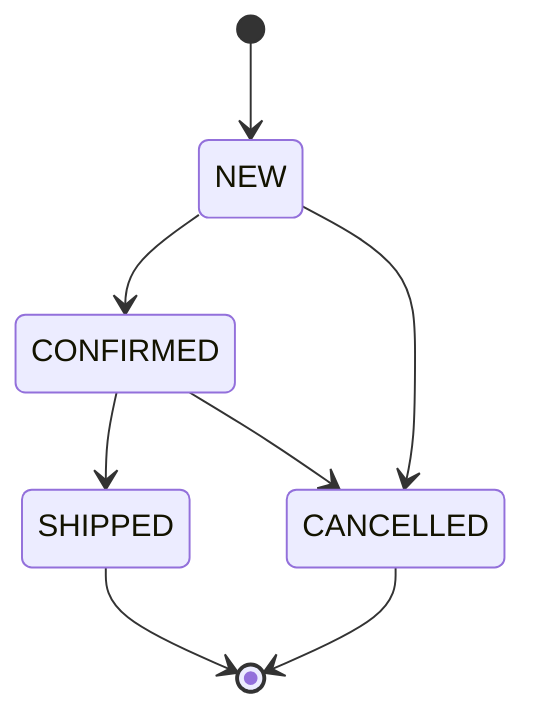

### 2.7 API design

N/A per spec §15 (release ships no external API).

## 3. Orchestration

### 3.1 Work breakdown

Single domain — every work item belongs to the whole-system domain, and each footprint is within the single repository.

| ID | Domain | Title | Description | Expected file footprint | Traces to |
|----|--------|-------|-------------|-------------------------|-----------|
| W-1 | whole system | Scaffolding and configuration | Create the Maven `pom.xml` (Java 8, Spring Boot 2.7.x, dependencies: web, thymeleaf, data-jpa, h2, test), the Spring Boot main class, and `application.properties` (in-memory H2, `ddl-auto=create`, Thymeleaf, port 8080). | `pom.xml`, `src/main/resources/**`, `src/main/java/**/Application.java`, `src/main/java/**/config/**` | C-6, FR-1 |
| W-2 | whole system | Domain model | Implement the shared JPA entities Customer, Product, Order, and OrderItem, plus the OrderStatus enum, with mappings and relationships. | `src/main/java/**/domain/**` | C-4, FR-2 |
| W-3 | whole system | Repository layer | Implement Spring Data JPA repository interfaces for Customer, Product, and Order. | `src/main/java/**/repository/**` | C-3, FR-2 |
| W-4 | whole system | Service layer | Implement CustomerService, ProductService, and OrderService with the business rules: SKU uniqueness, stock adjustment, transactional order placement (combine duplicate lines, validate stock, compute totals, decrement stock), status transitions, and cancel-restock. | `src/main/java/**/service/**` | C-2, FR-2, FR-3, FR-4, FR-5, FR-6 |
| W-5 | whole system | Web layer | Implement controllers, Thymeleaf templates, and plain CSS for the home page, customers, products, inventory, and orders, plus a generic error page and inline validation. | `src/main/java/**/web/**`, `src/main/resources/templates/**`, `src/main/resources/static/**` | C-1, FR-1 |
| W-6 | whole system | Data initializer | Implement an ApplicationRunner that seeds approximately 20 customers, 30 products, and 50 orders of fictional data at startup. | `src/main/java/**/init/**` | C-5, FR-1 |
| W-7 | whole system | Tests for AC-1 to AC-4 | Implement the minimal integration and service tests covering AC-1 (app starts, home returns 200), AC-2 (valid order decrements stock and computes totals), AC-3 (over-stock order rejected transactionally), and AC-4 (cancel restocks). Each test references its AC-ID. | `src/test/**` | C-2, FR-1, FR-2, FR-3, FR-4, FR-5, FR-6 |
| W-8 | whole system | Containerization | Create the multi-stage Dockerfile (Maven and Java 8 build stage, Java 8 JRE runtime stage, non-root user, pinned base images), `docker-compose.yml` publishing port 8080, `.dockerignore`, and the README build/run/teardown instructions. | `Dockerfile`, `docker-compose.yml`, `.dockerignore`, `README.md` | C-6, FR-1 |

### 3.2 Sequencing and dependencies

- **W-2 depends on:** W-1
- **W-3 depends on:** W-2
- **W-4 depends on:** W-2, W-3
- **W-5 depends on:** W-4
- **W-6 depends on:** W-2, W-3
- **W-7 depends on:** W-4, W-5, W-6
- **W-8 depends on:** W-1

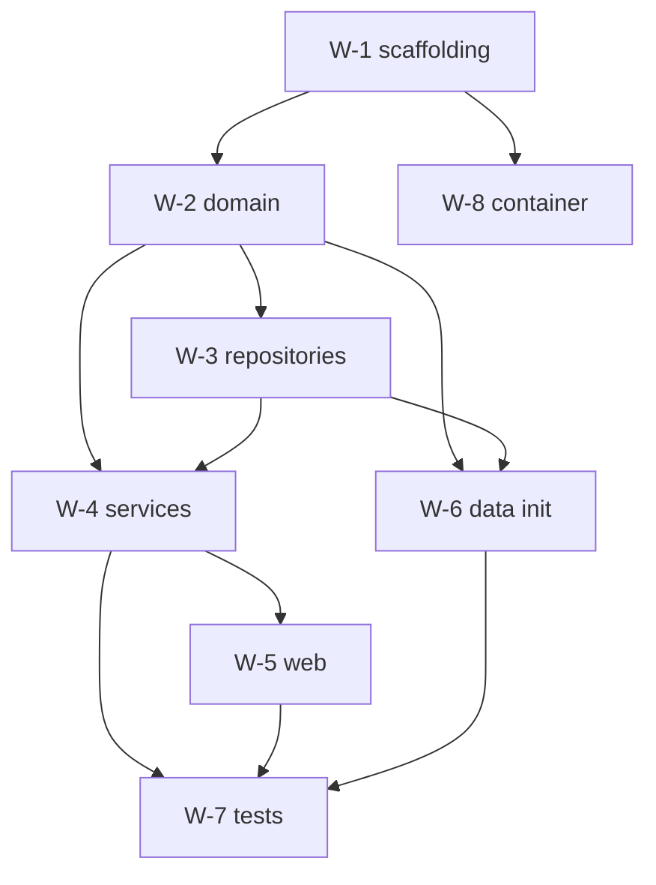
