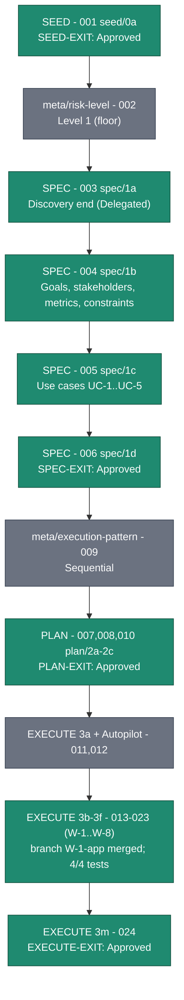

# Release-Execution Diagram — R-Z7UL7V

> Derived, non-authoritative visualization of the replay-execution log for release R-Z7UL7V (baseline `sdlc`, Level 1). Regenerable at any time from `R-Z7UL7V-execution-log.md`. Updated at every stage-exit gate.

## Gate summary

| Gate | Entry | Outcome |
| --- | --- | --- |
| SEED-EXIT | 001 | Approved |
| SPEC-EXIT | 006 | Approved |
| PLAN-EXIT | 010 | Approved |
| EXECUTE-EXIT | 024 | Approved |
