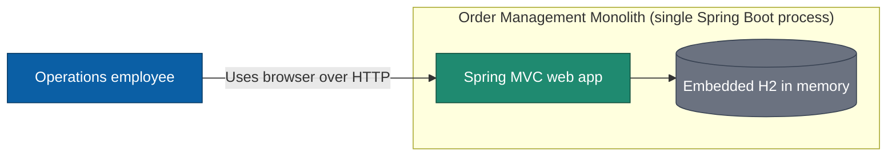
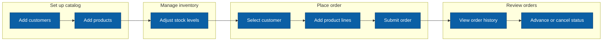

# Technical Specification — R-Z7UL7V

## Metadata

- **Release ID:** R-Z7UL7V
- **Discovery mode:** Delegated
- **Specialization:** baseline SDLC
- **Runtime target:** N/A
- **UX mode:** Delegated
- **API mode:** N/A
- **Spec confirmed date:** 2026-10-01

---

## 1. Goals

- Deliver a fictional, legacy-style three-tier Spring Boot monolith modeling a small order-management system, for demonstrations, training, and modernization exercises.
- Implement all three tiers (Spring MVC presentation, service business layer, Spring Data JPA data access) in one codebase, one process, and one deployable artifact.
- Run entirely locally via Docker — no host Java or Maven install, no cloud account, and no external services.
- Exhibit intentional legacy characteristics (package-by-layer organization, shared domain entities, tight coupling) that make the codebase a realistic modernization-exercise target.
- Enforce the core order-management business rules: inventory validation on order placement, order-total calculation, and cancel-restock.

## 2. Stakeholders

- **Colleague / developer** — primary builder and operator of the fixture.
- **Training / workshop participants** — use the fixture for architecture analysis and modernization exercises.
- **TWTTY AI coding agent** — builds the release end-to-end under this methodology.
- **In-application persona:** a single Operations employee (no authentication), who manages customers, products, inventory, and orders.

## 3. Success metrics

- **Build:** `docker compose build` completes with exit code 0.
- **Startup reachability:** after `docker compose up`, the home page returns HTTP 200 within a boot window of ≤ 60 seconds on a typical developer laptop.
- **Seed data volume:** after startup, the database contains approximately 20 customers, 30 products, and 50 orders.
- **Tested acceptance:** 4 of 4 acceptance criteria (AC-1 through AC-4) pass.
- **One-command run:** a developer with only Docker installed starts the complete application with a single documented command.

## 4. Constraints

- Technology baseline is fixed: Java 8, Spring Boot 2.7.x, Maven, Spring MVC with Thymeleaf server-rendered views, Spring Data JPA, and embedded H2 (in-memory).
- The system MUST be a single monolithic deployable: no microservices, no separate JavaScript front end, server-rendered HTML only.
- Execution is local only: Docker is the sole host dependency; Java 8 and Maven run inside the container build; no cloud, external database, or third-party service may be required.
- Data is fictional only: no real credentials, no real personal data, no deliberately introduced vulnerabilities, and no hand-rolled cryptography.
- Risk level is 1 (floor): reduced rigor is accepted and the fixture is not intended for real users, real or customer data, production traffic, or long-lived operation as a real system.
- The runtime container MUST use pinned base-image versions, run as a non-root user, and publish only the application port.

## 5. Domains and use cases

### 5.1 Domains

Single domain — the whole system.

**System context**

**User journey**

### 5.2 UC-1: Manage customers

- **Actors:** Operations employee
- **Triggers:** The employee needs to add or view a customer.
- **Main flow:** 1. Open the customer list. 2. Choose New customer. 3. Enter name (required) and optional email, phone, and address. 4. Save. 5. The system persists the customer and shows it in the list.
- **Exceptions:** A blank name re-renders the form with a validation message and nothing is saved.
- **Dependencies:** None (customers are a root entity).

### 5.3 UC-2: Manage products

- **Actors:** Operations employee
- **Triggers:** The employee needs to add a new product or update an existing one.
- **Main flow:** 1. Open the product list. 2. Choose New product or edit an existing product. 3. Enter SKU, name, and unit price. 4. Save. 5. The system persists the product.
- **Exceptions:** A duplicate SKU is rejected; a negative price is rejected; the form is re-rendered with field-level messages.
- **Dependencies:** None.

### 5.4 UC-3: Manage inventory

- **Actors:** Operations employee
- **Triggers:** A product's stock level needs adjusting.
- **Main flow:** 1. Open the product list showing current stock. 2. Choose Adjust stock for a product. 3. Enter the new quantity on hand. 4. Save. 5. The system updates the quantity.
- **Exceptions:** A negative quantity is rejected.
- **Dependencies:** UC-2 (products must exist).

### 5.5 UC-4: Place order

- **Actors:** Operations employee
- **Triggers:** A customer places an order.
- **Main flow:** 1. Choose New order. 2. Select a customer. 3. Add product line items with quantities. 4. Submit. 5. The system validates each quantity against available stock, combines duplicate product lines by summing quantities, computes each line total and the order total, decrements stock, and persists the order with status NEW.
- **Exceptions:** A quantity exceeding stock, an empty order, or a zero or negative quantity causes the order to be rejected transactionally with messages and no stock change; a product at zero stock cannot be added.
- **Dependencies:** UC-1 (customers), UC-2 (products), UC-3 (stock).

### 5.6 UC-5: Review orders

- **Actors:** Operations employee
- **Triggers:** The employee reviews order history or progresses an order.
- **Main flow:** 1. Open the order list. 2. Open an order to view its details and totals. 3. Advance status from NEW to CONFIRMED to SHIPPED, or cancel the order. 4. On cancel, the system restocks the order's items.
- **Exceptions:** An illegal status transition is rejected; a shipped order cannot be cancelled; an unknown order id returns a 404 page.
- **Dependencies:** UC-4 (orders must exist).

## 6. Functional requirements (FR)

- **FR-1:** The system is a single Spring Boot monolith that starts successfully and serves a server-rendered employee home page over HTTP.
- **FR-2:** An Operations employee can place an order for a customer consisting of one or more product line items.
- **FR-3:** On successful order placement, the system computes each line total as quantity multiplied by unit price, and the order total as the sum of the line totals.
- **FR-4:** On successful order placement, the system decrements each ordered product's stock on hand by the ordered quantity.
- **FR-5:** The system rejects an order in which any line quantity exceeds that product's available stock, persisting no order and leaving all stock unchanged.
- **FR-6:** Cancelling an order returns each line item's quantity to the corresponding product's stock on hand.

## 7. Non-functional requirements (NFR)

None for this release. Technology, container-hardening, and data constraints are stated in §4 Constraints; per the Level 1 minimal-testing decision, no non-functional requirement is elevated to a tested acceptance criterion.

## 8. Acceptance criteria

- **AC-1:** Starting the application and issuing an HTTP GET to the home page returns HTTP 200 with a rendered page.
  - **Traces to:** FR-1
- **AC-2:** Placing an order with valid line items persists the order with status NEW, decrements each product's stock on hand by the ordered quantity, and records line totals and an order total equal to the sum of quantity multiplied by unit price for each line.
  - **Traces to:** FR-2, FR-3, FR-4
- **AC-3:** Submitting an order in which a line quantity exceeds available stock results in no persisted order and no change to any product's stock on hand.
  - **Traces to:** FR-5
- **AC-4:** Cancelling an existing order increases each referenced product's stock on hand by the previously ordered quantity.
  - **Traces to:** FR-6

## 13. UX requirements

### 13.1 Task efficiency

Every primary task (create customer, create product, adjust stock, place order, review order) is reachable from the main navigation in no more than two clicks. There are no splash, welcome, or intermediate landing pages. A confirmation step appears only for order cancellation, the single state-reversing action.

### 13.2 Interaction

Every form submission produces a visible result within the returned page: an updated list, a detail view, or inline field-level validation messages. All primary actions are operable by keyboard using standard HTML form controls and links. Order cancellation requires a confirmation step.

### 13.3 Accessibility

The UI targets WCAG 2.2 Level AA for its forms and tables: semantic HTML (labelled inputs, table headers, landmark regions), text contrast of at least 4.5:1, large text and UI components at least 3:1, and visible keyboard focus on all interactive elements. **Reduction (recorded for informed SPEC-EXIT approval):** at Level 1 there is no CI pipeline and the Human User declined additional testing, so automated accessibility testing (axe-core, WAVE, or equivalent) is not wired. Accessibility is therefore a non-tested design target for this release.

### 13.4 Testing

Nielsen's 10 usability heuristics are reviewed as a checklist before EXECUTE-EXIT. No formal usability test (N ≥ 3) is conducted because the fixture ships to no end users. Automated accessibility testing is not wired, per the §13.3 reduction.

### 13.5 Delegated-mode disclosures

| # | Choice | Rationale |
| --- | --- | --- |
| U-1 | No authentication; a single implicit operator | The local throwaway fixture stores nothing sensitive, so omitting auth keeps the UI minimal and the focus on the business workflows. |
| U-2 | Server-rendered Thymeleaf pages; no client-side JavaScript framework | Matches the legacy Spring MVC target and avoids introducing a separate front-end application. |
| U-3 | Accessibility is a non-tested design target (WCAG 2.2 AA aimed for, not automated-tested) | Level 1 has no CI and the Human User declined added testing; this records the UX-bar reduction explicitly. |
| U-4 | Confirmation dialog only on order cancel; no other confirmation prompts | Cancel is the only state-reversing action, so limiting confirmations preserves task efficiency. |

## 14. Data classification

### 14.1 Data classes present in this release

| Class | Present? | Examples in this release |
| --- | --- | --- |
| public | no | — |
| internal | yes | Fictional demonstration data: customers, products, inventory levels, and orders |
| confidential | no | — |
| restricted | no | — |

### 14.2 PII inventory

No PII stored, processed, or transmitted by this release.

### 14.3 Retention windows

| Class | Maximum retention | Deletion policy |
| --- | --- | --- |
| internal | Ephemeral (in-memory only, lifetime of the running container) | Discarded automatically on container stop or restart; never persisted to durable storage |

### 14.4 Regulatory scope

None.

## 15. API requirements and contract

N/A per §11 (release ships no external API).
